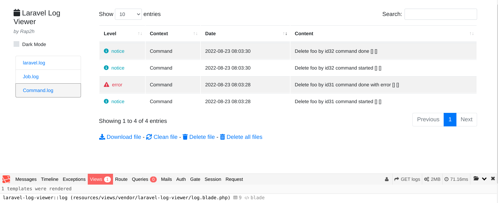

## Дебаг ассистент (Larvel 5.5 Php 7.0)

Для решения описанных задач, предлагается использовать [Laravel debugbar](https://github.com/barryvdh/laravel-debugbar/tree/2.4), расширенное стандартное логирование (Helpers/LogToChannels) для Job и Command в отдельные файлы (Job.log, Command.log), web интерфейс для просмотра логов  [Laravel log viewer](https://github.com/rap2hpoutre/laravel-log-viewer). 
Для демонстрации работы, представлен минимальный функционал:
 
Собранные метрики, [Laravel debugbar](https://github.com/barryvdh/laravel-debugbar/tree/2.4) логирует в файлы в формате json, которые можно в дальнейшем использовать, например для вывода дополнительной информации в web интерфейс.  

## Разворот

1. `git clone git@github.com:ilyazenQ/laravel5.5-logger.git
   <new-repo-name>`
2. `docker-compose up -d` (Может потребоваться VPN)
3. `docker exec -it <container_name> bash`
4. `composer i`
5. `cp .env.example .env`
6. Указываем в .env доступы 
   DB_CONNECTION=mysql
   DB_HOST=db
   DB_PORT=3306
   DB_DATABASE=laravel
   DB_USERNAME=root
   DB_PASSWORD=root
7. `php artisan key:generate` 
8. `php artisan storage:link` 
9. `php artisan migrate` 